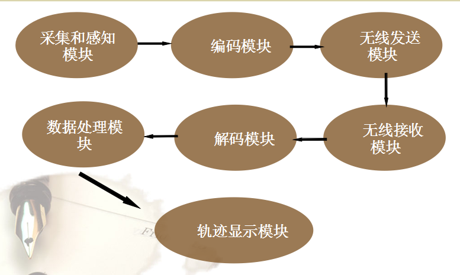
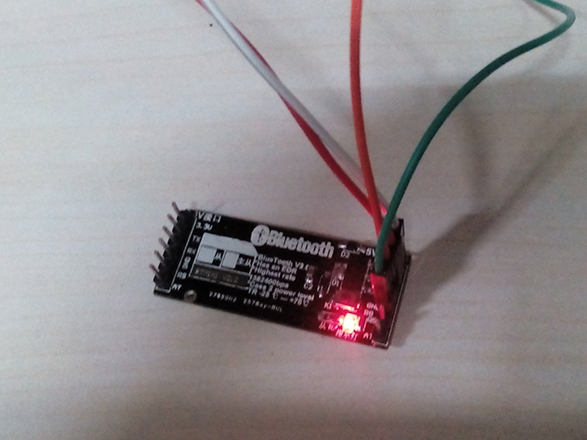

<h2>
<a name="WirelessShow-lowerComputer" class="anchor" href="#WirelessShow-lowerComputer"></a>WirelessShow-lowerComputer</h2>

a lower computer program basing on STM32f4 MPU cooperating with WirelessShow repo which is an upper computer program

<h2>
<a name="lower-computer-part" class="anchor" href="#lower-computer-part"></a>一、下位机部分(lower computer part)</h2>

<h3>
<a name="general-description" class="anchor" href="#general-description"></a>1、总体说明(general description)</h3>

<ul class="task-list">
<li>（1）下位机在ST公司的stm32f4系列MPU平台上开发，核心器件加速度传感	器采用ST公司推出的LIS302DL系列三轴加速度传感器；</li>
<li>（2）MPU控制下位机逻辑，传感器以400HZ采样率采集加速度数据，并通过SPI高速总线实时传送给MPU；</li>
<li>（3）用户数据包括segment(加速度采样值)和index(各次采样数据即各segment的索引)两部分，index中包含segment的名称、起始存储地址和容量大小等数据，用户数据全部存储在MPU的flash中，断电不丢失；</li>
<li>（4）系统支持最多7段独立的采样，每段采样最多128K数据量；</li>
<li>（5）下位机可在任意时刻与上位机通过串口通信方式交互数据，用户可通过上位机实现对下位机用户数据的操作(详见上位机部分)。</li>

</ul>

<h3>
<a name="how-to-use" class="anchor" href="#how-to-use"></a>2、使用说明(how to use)</h3>
<ul class="task-list">
	<li>（1）嵌入式系统开机或复位后系统处于空闲状态，此时4盏指示灯轮流闪烁；</li>
	<li>（2）空闲状态下，按下PB11键（高电平）进入与上位机串口通信状态，此时4盏指示灯全亮。如果串口通信握手失败，则4盏指示灯依次熄灭之后，系	统自动进入空闲状态；</li>
	<li>（3）空闲状态下，按下PB12键（高电平）进入格式化flash状态，flash中用户数据将全部删除，此时4盏指示灯全闪烁后全灭，系统自动进入空闲状态；</li>
	<li>（4）空闲状态下，按下user键退出空闲状态，采样配置初始化之后进入采样状态，此时4盏指示灯依次亮灭；</li>
	<li>（5）采样状态下，按下user键退出采样状态，进入数据善后状态，此时4盏指示灯全灭后全亮，随后系统自动进入空闲状态；</li>
	<li>（6）采样状态下，如果系统存储空间已满，则此时4盏指示灯全灭，退出采样状态并自动进入空闲状态；</li>
	<li>（7）采样状态下，如果系统写入flash出错，则此时4盏指示灯全亮后全灭，系统退出采样状态并自动进入空闲状态。</li>
</ul>

<h2>
<a name="upper-computer-part" class="anchor" href="#upper-computer-part"></a>二、上位机部分(upper computer part)</h2>
refer to <a href="https://github.com/hugochan/WirelessShow">hugochan/WirelessShow</a>

<h2>
<a name="presentation" class="anchor" href="#presentation"></a>三、图片展示(presentation)</h2>
<h3>
	
系统框图
</h3>
&nbsp;&nbsp;&nbsp;&nbsp;</img>
    

<h3>
	
蓝牙模块
</h3>
&nbsp;&nbsp;&nbsp;&nbsp;</img>
    